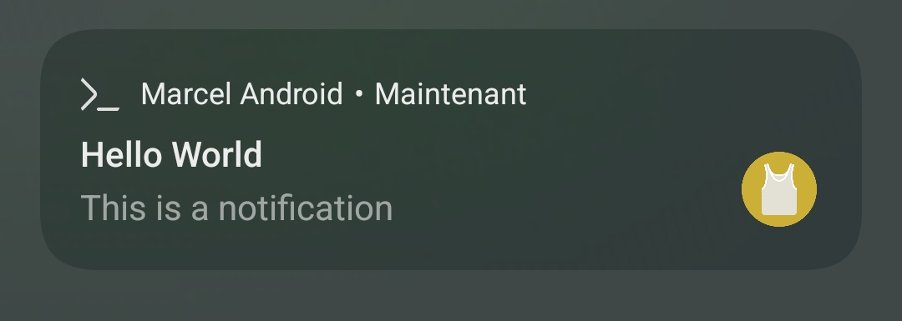

# Marcel for Android
Marcel for Android is the Marshell app made for Android, but with additional features. You can download it [here](https://play.google.com/store/apps/details?id=com.tambapps.marcel.android.marshell).

Note that it was designed for dark theme so **this app is much more UI friendly in dark mode**.
An update will come soon(-ish) to better handle light mode.

With this app you can
- Run Marcel shells, as you would using Marshell
- edit Marcel source codes
- Schedule Shell Works, a concept allowing you to run Marcel scripts in the background, with the possibility to schedules the works
and make them periodic.

You can consult the privacy policy of this app [here](#privacy-policy).

## Initialization scripts

You can also use [Marshell's initialization scripts](./marshell.md#initialisation-script) to enhance your experience.


## Send System Notifications from Marcel Script

Marcel for Android has integration with your Android system APIs. You can write code
that sends a system notification to your Android device. This also applies to [Shell Workouts](marcel-for-android.md#shell-workouts), meaning that you can
notify your device in your script executed in the background.

### Send Notification

Here is an example of code to notify.

```marcel
AndroidSystem.notify('Hello World', 'This is a notification')
```



## Send SMS from Marcel Script

**FEATURE NOT ACCESSIBLE FROM PLAYSTORE RELEASE**:
sending SMS is not a core functionality of my app, that's why, unfortunately, Google prevents me from enabling this feature on the published app in the PlayStore.


Marcel for Android has integration with your Android system APIs. You can write code
that sends SMS. This also applies to [Shell Workouts](marcel-for-android.md#shell-workouts), meaning that you can
schedule for later a SMS.

### SMS Permission

Before being able to send an SMS from a Marcel script, you must allow the app to do so. Go to the Settings screen, and
then enable the 'Send SMS' permission, as shown in the below screenshot.


### Send SMS

Here is an example of code to send SMS.

```marcel
AndroidSystem.sendSms('+331234567890', 'Hello World')
```

Marcel cannot access your contacts, so you'll have to put the international phone numbers, in E.164 format (the format starting with `+`).

### List SMS

You can list sent SMS to track their status.
```marcel
AndroidSystem.listSms()
```

### Screenshots

<p align="center">
  
  
</p>

## Shell Workouts

Shell Workouts are scripts that you can execute in the background. They can perform heavy
I/O operations while you do other things on your phone.

They were implemented using [Android's WorkoutManager](https://developer.android.com/topic/libraries/architecture/workmanager).

Thanks to these APIs, you can **schedule** Shell Workouts to run at a specific time, and/or make them **periodic**
so that they are run every x hours.

TODO add screenshot and examples

## Privacy Policy

**Marcel for Android** is an open-source application. You can consult its full source code on [GitHub](https://github.com/tambapps/marcel).

This application **does not collect any analytics or personal data** from its users.

