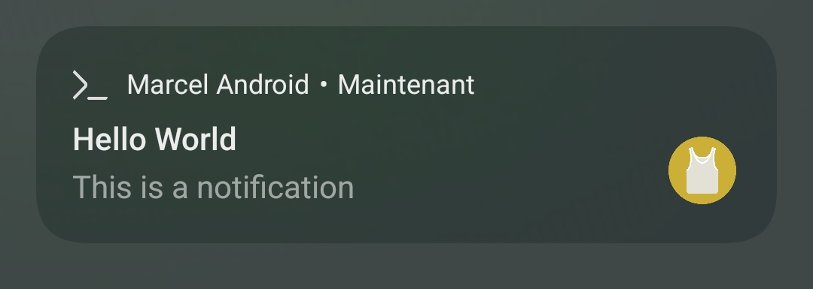

# Send System Notifications from Marcel Script

**NOT RELEASED YET**

Marcel for Android has integration with your Android system APIs. You can write code
that sends a system notification to your Android device. This also applies to [Shell Workouts](./shell-workout.md), meaning that you can
notify your device in your script executed in the background.

## Send SMS

Here is an example of code to notify.

```marcel
system.notify('Hello World', 'This is a notification')
```


