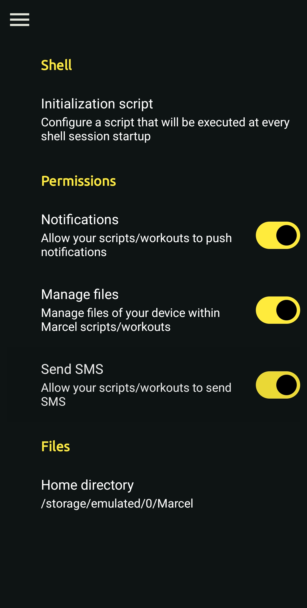
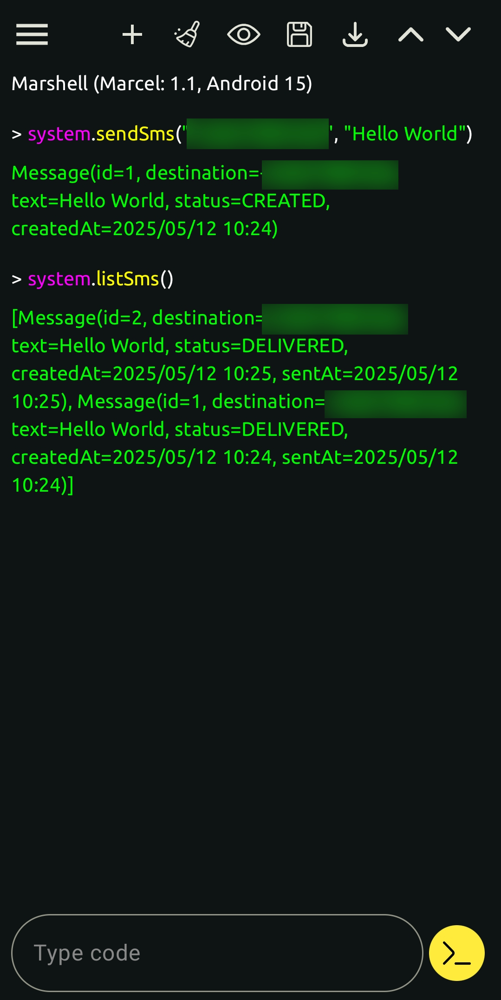

# Send SMS from Marcel Script

**FEATURE NOT ACCESSIBLE FROM PLAYSTORE RELEASE**: 
sending SMS is not a core functionality of my app, that's why, unfortunately, Google prevents me from enabling this feature on the published app in the PlayStore.


Marcel for Android has integration with your Android system APIs. You can write code
that sends SMS. This also applies to [Shell Workouts](./shell-workout.md), meaning that you can
schedule for later a SMS.

## SMS Permission

Before being able to send an SMS from a Marcel script, you must allow the app to do so. Go to the Settings screen, and
then enable the 'Send SMS' permission, as shown in the below screenshot.


## Send SMS

Here is an example of code to send SMS.

```marcel
AndroidSystem.sendSms('+331234567890', 'Hello World')
```

Marcel cannot access your contacts, so you'll have to put the international phone numbers, in E.164 format (the format starting with `+`).

## List SMS

You can list sent SMS to track their status.
```marcel
AndroidSystem.listSms()
```

## Screenshots

<p align="center">
  
  
</p>

