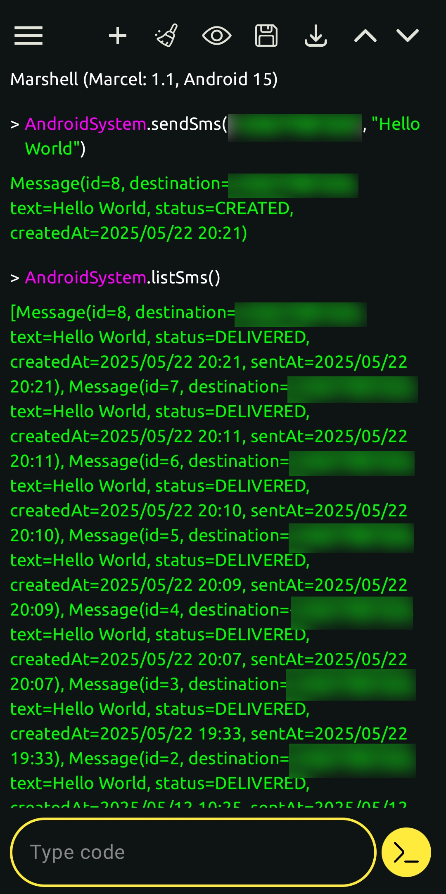

# Send SMS from Marcel Script

**NOT RELEASED YET**

Marcel for Android has integration with your Android system APIs. You can write code
that sends SMS. This also applies to [Shell Workouts](./shell-workout.md), meaning that you can
schedule for later a SMS.

## Send SMS

Here is an example of code to send SMS.

```marcel
system.sendSms('+331234567890', 'Hello World')
```

Marcel cannot access your contacts, so you'll have to put the international phone numbers, in E.164 format (the format starting with `+`).

## List SMS

You can list sent SMS to track their status.
```marcel
system.listSms()
```


